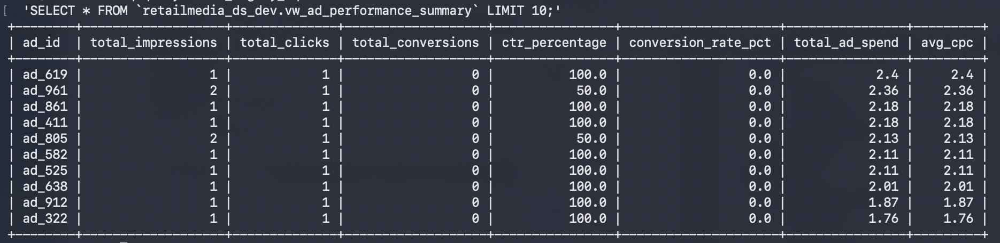
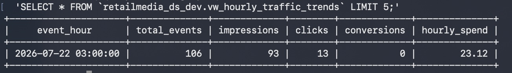
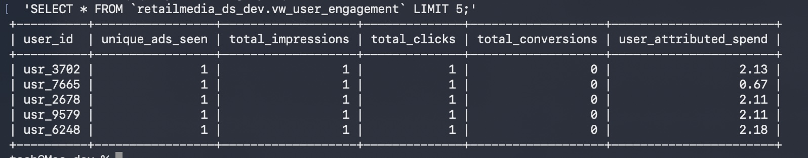

# RetailMedia Pulse 📡

**RetailMedia Pulse** is an end-to-end streaming data pipeline designed for real-time retail media advertising analytics.

## Key Features
* **Event Streaming Producer:** Modular Python producer publishing simulated real-time ad engagement logs (`impression`, `click`, `conversion`).
* **Low-Latency Ingestion:** Direct GCP Pub/Sub to BigQuery subscription streaming using schema matching.
* **Fault-Tolerant DLQ Architecture:** Automatic dead-letter queue routing for malformed or unparseable payloads with complete Pub/Sub metadata auditing (`ad_events_dlq`).
* **Analytical Reporting Layer:** Automated BigQuery SQL views (`vw_ad_performance_summary`, `vw_hourly_traffic_trends`, `vw_user_engagement`) computing CTR, CPC, and conversion metrics on live stream data.
* **100% Infrastructure as Code:** Provisioned and managed entirely via Terraform (`main.tf`).

## Project Structure
 
```text
.
├── assets/                                 # Visual proof & query sample outputs for documentation
│   ├── vw_ad_performance_summary           # Query output/screenshot verifying performance summary view
│   ├── vw_hourly_traffic_trends            # Query output/screenshot verifying hourly traffic trends view
│   └── vw_user_engagement                  # Query output/screenshot verifying user engagement view
│
├── environments/                           # Infrastructure configurations organized by deployment stage
│   ├── dev/                                # Development environment deployment
│   │   ├── main.tf                         # Module call & GCP provider configuration for DEV
│   │   ├── outputs.tf                      # Exposes DEV pipeline output values (dataset IDs, topics)
│   │   ├── terraform.tfstate               # Active Terraform state tracking deployed DEV resources
│   │   ├── terraform.tfstate.backup        # Backup state file prior to latest DEV terraform apply
│   │   ├── terraform.tfvars                # Real parameter values for DEV (project_id, region, etc.)
│   │   └── variables.tf                    # Root-level variable definitions for DEV
│   ├── prod/                               # Production environment deployment
│   │   ├── main.tf                         # Module call & GCP provider configuration for PROD
│   │   ├── outputs.tf                      # Exposes PROD pipeline output values
│   │   ├── terraform.tfvars                # Real parameter values for PROD environment
│   │   └── variables.tf                    # Root-level variable definitions for PROD
│   └── uat/                                # User Acceptance Testing (UAT) environment deployment
│       ├── main.tf                         # Module call & GCP provider configuration for UAT
│       ├── outputs.tf                      # Exposes UAT pipeline output values
│       ├── terraform.tfvars                # Real parameter values for UAT environment
│       └── variables.tf                    # Root-level variable definitions for UAT
│
├── modules/                                # Reusable, modularized Terraform definitions
│   └── streaming_pipeline/                 # Core streaming pipeline module
│       ├── main.tf                         # Core resource declarations (Pub/Sub, BQ tables, IAM, Views)
│       ├── outputs.tf                      # Module output definitions exported to environment roots
│       └── variables.tf                    # Input variable declarations required by the module
│
├── src/                                    # Python application source code for streaming pipeline
│   ├── generator.py                        # Generates realistic mock ad-interaction payload data
│   ├── producers/                          # Streaming publishers and testing utility scripts
│   │   ├── producer.py                     # Primary Pub/Sub producer streaming logs to ad-events-stream
│   │   └── test_dlq.py                     # Test producer firing malformed payloads to test DLQ logic
│   └── utils/                              # Utility helper modules (logging, GCP client initialization)
│
├── terraform_config/                       # Legacy or root-level state backups
│   ├── terraform.tfstate                   # Root-level Terraform state file
│   └── terraform.tfstate.backup            # Previous root-level Terraform state backup
│
├── venv/                                   # Isolated Python virtual environment directory
│   ├── bin/                                # Executables (python, pip, gcloud/CLI hooks)
│   ├── include/                            # C headers for compiled Python packages
│   └── lib/                                # Installed Python third-party dependencies (google-cloud-pubsub, etc.)
│
├── LICENSE.txt                             # Repository software usage license terms
├── README.md                               # Project documentation, architecture overview, and setup guide
├── terraform                               # Standalone Terraform CLI binary binary file
└── terraform.zip                           # Compressed distribution archive for Terraform installer
```

## Prerequisites

Before running this configuration, ensure you have installed:
* [Terraform CLI](https://developer.hashicorp.com/terraform/downloads) (v1.5+)
* Cloud CLI (e.g., [AWS CLI](https://aws.amazon.com/cli/) or [Azure CLI](https://docs.microsoft.com/en-us/cli/azure/)) configured with appropriate permissions.

## Getting Started

### 1. Initialize Working Directory
Initialize the backend and download required provider plugins:
```bash
terraform init
```

### 2. Review Execution Plan
Generate and inspect the execution plan:
```bash
terraform plan
```

### 3. Apply Configuration
Provision the infrastructure:
```bash
terraform apply
```

### 4. Teardown / Cleanup
To destroy all provisioned infrastructure:
```bash
terraform destroy
```

## Security & Best Practices
* Never commit `terraform.tfvars` files containing secret keys or API credentials.
* Remote state storage should be configured (e.g., AWS S3 + DynamoDB lock) for team collaboration.


### 📊 Analytical Query Results

#### 1. Ad Performance & CTR Summary


#### 2. Hourly Traffic & Spend Trends


#### 3. Top Engaged Users


